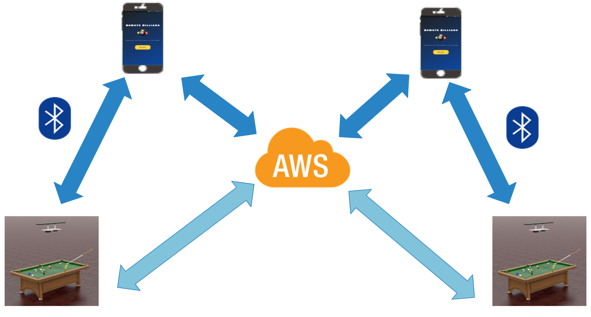
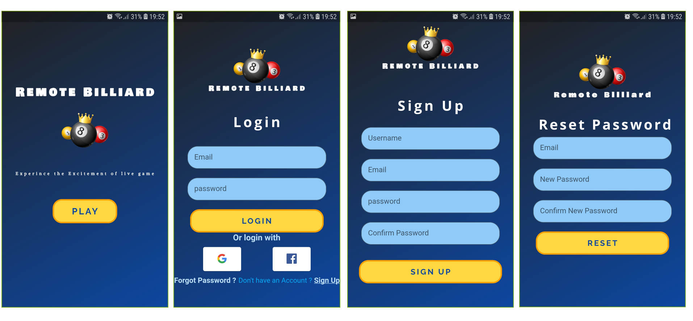
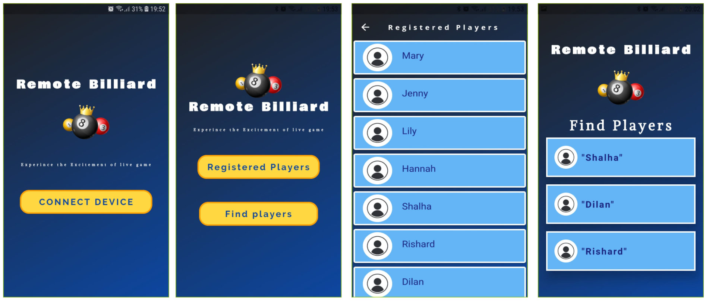
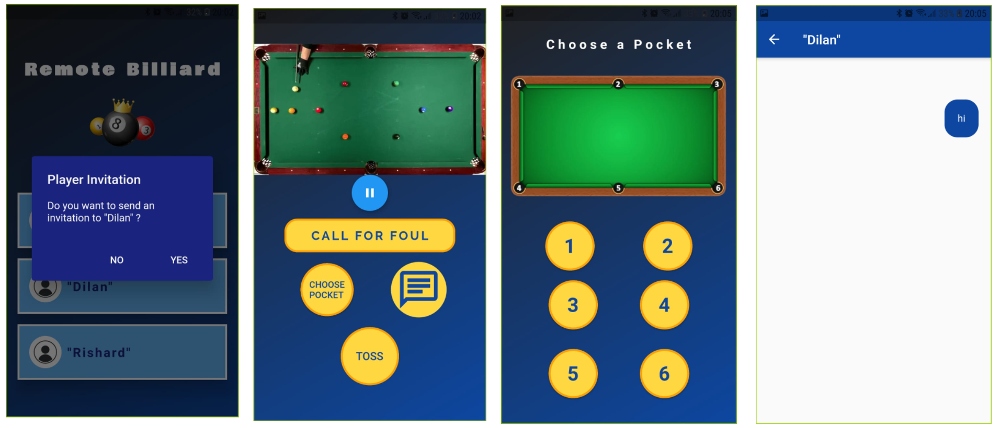
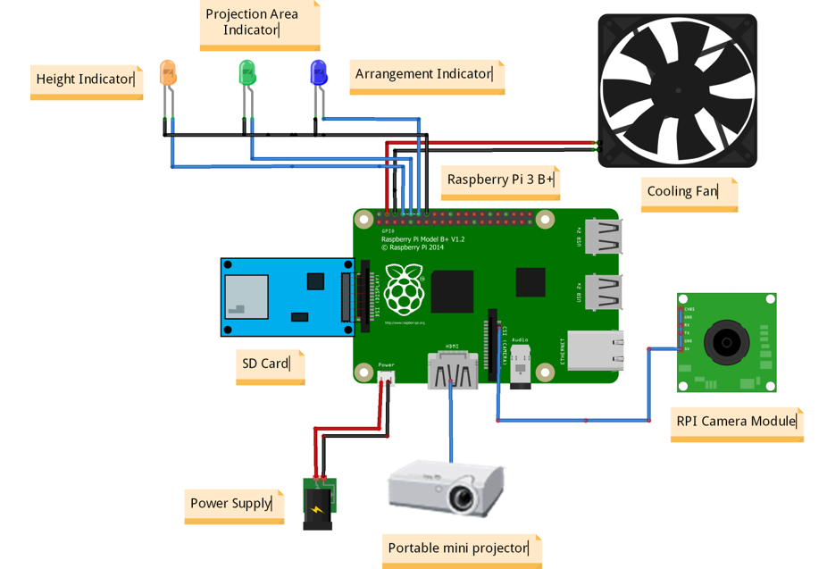

<!-- ---
layout: home
permalink: index.html

# Please update this with your repository name and project title
repository-name: eYY-3yp-project-template
title: Project Template
--- -->

[comment]: # "This is the standard layout for the project, but you can clean this and use your own template"

# Remote Billiard
## Introduction

“Remote-Billiard” is a project which provides usual Billiard game experience via online platform.Not all the players could be in the same place to play a billiard game now a days. Project “Remote-Billiard” solves this problem. Players can play their game physically at their own places individually.

---
# Our Setup

---

## Problems

- Busy schedules

- Unreachable distances between players

- Pandemic situation

- Online billiard games do not provide the expected physical experience.

- Online games do not help to improve the required skills.

- Wastage of money and resources in conducting global events( Games)

Usually if a pool game is supposed to be played, the players should physically be present. But the issue is not everyone has the luxury of time to attend a game due to various reasons. In this case, the least thing that they could do is play the game online via a mobile or a PC with their friends. But if you ask such players whether the experience was satisfying, they would definitely say no! So to avoid this issue we have planned to give the player the so called Physical experience at their own comfort zones. According to our plan we will be solving a lot of problems such as the issue with time, travelling issue, could reduce expenses and will be able to provide the player the real physical experience which would be a great chance to enhance their skills at the same time would be more fun than online games. Therefore in overall , Remote-Billiard project solves these problems.

---
## Solution 
Allows players to play the same pool game while being at different locations.After one player plays a shot, the ball arrangement of the board is captured and this image is then processed and is projected onto the next players’ pool board. Then this player will arrange the balls according to the projected image and will start playing his shot.

---

## Solution Overview 

---

## Mobile Application 
Allows players to connect with opponent players by searching currently available online players.When the game is start both of the players can see the opponent players pool table throught the mobile application.If a player detect a foul he can use call for foul option.Chat option will help player to communicate with the opponent player.Flutter is used to develop the mobile application.

---
## Hardware
### Circuit Diagram

- Raspberry Pi 3 B+ : Controller system.

- Camera Module : CSI Port.

- Mini Projector : HDMI port.

- Power Supply : Micro USB port

- Cooling Fan : GPIO pins

- Indicators : GPIO pins

---
## Testing plan
### Software Tesing
#### Mobile app

- Check the Validity of log in details(email,password)

#### Database and Server

- Client and server connection establishment

- Get details about currently available online users

- Check database game history updates

- Check server handling of multiple games happening between multiple pairs

---
## Bill Of Material

---

## Team
-  E/17/005, Ahamed M.I.R, [e17005@eng.pdn.ac.lk](e17005@eng.pdn.ac.lk)
-  E/17/327, Shalha.A.M.F, [e17327@eng.pdn.ac.lk](e17327@eng.pdn.ac.lk)
-  E/17/379, Weerasinghe.S.P.D.D.S, [e17379@eng.pdn.ac.lk](e17379@eng.pdn.ac.lk)

## Supervisors
1. Dr. Isuru Nawinne [[Website](http://www.ce.pdn.ac.lk/academic-staff/isuru-nawinne/), [Email](mailto:isurun@eng.pdn.ac.lk)]
2. Dr. Mahanama Wickramasinghe [[Website](http://www.ce.pdn.ac.lk/2021/05/02/dr-mahanama-wickramasinghe/), [Email](mailto:mahanamaw@eng.pdn.ac.lk)]

## LINKS
- [Project Page](https://cepdnaclk.github.io/e17-3yp-remote-billiard/)
- [Department Web Site](http://www.ce.pdn.ac.lk/)
